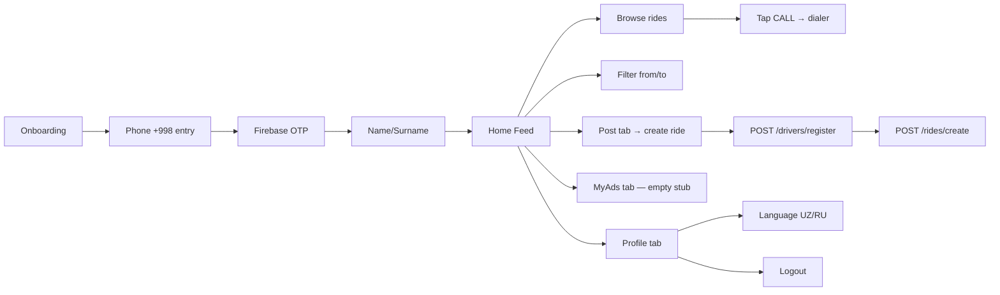

# WaynixGO — Release Readiness Report

_Last updated: 2026-05-28_

## What the app is

**WaynixGO** is a peer-to-peer ride-listing app for Karakalpakstan (Nukus + 17
districts in [`waynixDistricts`](../WaynixGoApp/app/src/main/java/com/example/waynixgoapp/data/WaynixDistricts.kt:4)).
It is **not** a taxi-hailing app like Yandex Go / Bolt. Closer to a
notice board:

- A driver posts a ride: from, to, time, price, seats, comment.
- Other users browse listings, filter by from/to, then **call the driver
  directly** via [`Intent.ACTION_DIAL`](../WaynixGoApp/app/src/main/java/com/example/waynixgoapp/ui/components/Cards.kt:180).
- No in-app booking, no payments, no map, no live tracking, no chat.

Stack:

- **Android**: Kotlin + Jetpack Compose, Material3, Retrofit + Gson, Firebase
  Auth (Phone/SMS OTP), SharedPreferences for "session". Single Activity,
  manual tab switching (no Navigation-Compose despite the dependency).
- **Backend**: Django 4.2/6.0 + DRF + SQLite, three models
  (Driver/RideOffer/Booking), auth-less REST.
- Bottom nav: 4 tabs — Home, MyAds, Post (FAB), Profile.

## End-to-end feature map

## Verdict

**Not ready for Play Store.** Functionally an MVP demo. Multiple blockers
across security, policy compliance, build config, UX completeness, and backend
infrastructure. Realistic estimate: **3–6 weeks** of focused work to reach an
MVP-grade public release.

## Blockers

### Build / packaging

- [`applicationId = "com.example.waynixgoapp"`](../WaynixGoApp/app/build.gradle.kts:12).
  Google Play **rejects** `com.example.*` package IDs. Need a real
  reverse-domain ID, e.g. `uz.waynix.go`.
- [`isMinifyEnabled = false`](../WaynixGoApp/app/build.gradle.kts:23) in
  release. Should be `true` with `shrinkResources = true` and ProGuard rules
  for Retrofit/Gson/Firebase. Current
  [`proguard-rules.pro`](../WaynixGoApp/app/proguard-rules.pro:1) is empty.
- Typo: `proguardrules.pro` (no dash) in
  [`build.gradle.kts:26`](../WaynixGoApp/app/build.gradle.kts:26) — Gradle
  silently ignores the file. Should be `proguard-rules.pro`.
- No release signing config. Play wants an upload key + Play App Signing.
- `targetSdk = 34` on `compileSdk = 36`. Play current minimum target SDK
  requirement is 35. Bump to 35.
- No App Bundle (`.aab`) build path documented. Play requires AAB.
- App name on launcher is `WaynixGoApp`
  ([`strings.xml:2`](../WaynixGoApp/app/src/main/res/values/strings.xml:2)).
  Should be `Waynix GO` or similar marketing name.

### Security / Privacy / Play Policy

- [`android:usesCleartextTraffic="true"`](../WaynixGoApp/app/src/main/AndroidManifest.xml:17)
  and `BASE_URL = "http://192.168.1.15:8000/"`
  ([`ApiService.kt:88`](../WaynixGoApp/app/src/main/java/com/example/waynixgoapp/data/network/ApiService.kt:88)).
  The whole app talks to a hardcoded LAN IP over plain HTTP. Will not work on
  any user's phone outside that LAN. Need a real domain, HTTPS, and Network
  Security Config.
- Firebase API key + project ID committed in
  [`google-services.json`](../WaynixGoApp/app/google-services.json:18). API
  key in client is OK technically, but the project should have App Check, SHA-1
  restriction, and quota controls.
- `CALL_PHONE` permission declared in
  [`AndroidManifest.xml:6`](../WaynixGoApp/app/src/main/AndroidManifest.xml:6)
  but only `ACTION_DIAL` is used
  ([`Cards.kt:180`](../WaynixGoApp/app/src/main/java/com/example/waynixgoapp/ui/components/Cards.kt:180)),
  which does not require `CALL_PHONE`. Play will ask why. Remove the
  permission.
- No Privacy Policy URL. Play requires one (collects phone, name, IP,
  Firebase Auth tokens). Must be hosted publicly and linked in the Play
  Console + inside the app.
- No Data Safety form filled (Play Console mandatory).
- No in-app Terms of Service / Privacy links. The onboarding screen shows
  hardcoded Russian-only legal text
  ([`AuthScreens.kt:305`](../WaynixGoApp/app/src/main/java/com/example/waynixgoapp/AuthScreens.kt:305))
  but no actual link.
- Backend: `DEBUG=True`, `SECRET_KEY` hardcoded, `ALLOWED_HOSTS=['*']`,
  `CORS_ALLOW_ALL_ORIGINS=True`
  ([`settings.py:8`](../taxi_backend/config/settings.py:8)).
  Production-fatal.
- No auth on backend API — anyone with the URL can register drivers, post
  rides, change statuses by spoofing `driver_id`. Backend never verifies
  Firebase ID tokens.
- PII leaks: `/api/drivers/` returns full `phone` and `card_number` to anyone
  ([`serializers.py:15`](../taxi_backend/rides/serializers.py:15)).
- "Test code: 123456" hint shown in OTP screen
  ([`Localization.kt:104`](../WaynixGoApp/app/src/main/java/com/example/waynixgoapp/ui/theme/Localization.kt:104))
  — misleading; the app uses real Firebase SMS, not a fixed test code.
- `android:allowBackup="true"`
  ([`AndroidManifest.xml:9`](../WaynixGoApp/app/src/main/AndroidManifest.xml:9))
  with empty backup rules — phone, name, language are backed up to Google
  Drive. Configure exclusions or set `allowBackup="false"`.

### UX / functional gaps

- **Day tabs do nothing on Home.**
  [`HomeScreen`](../WaynixGoApp/app/src/main/java/com/example/waynixgoapp/ui/screens/HomeScreen.kt:21)
  reads `dayTab` but never filters by it.
- **Filter is client-side only.** Backend supports `?from`, `?to`, but
  [`HomeViewModel.refreshRides`](../WaynixGoApp/app/src/main/java/com/example/waynixgoapp/ui/screens/HomeViewModel.kt:28)
  is always called with no params. Pagination not used.
- **MyAds tab is a stub.**
  [`MyAdsScreen`](../WaynixGoApp/app/src/main/java/com/example/waynixgoapp/ui/screens/MyAdsScreen.kt:28)
  shows static "no active requests / history empty" with hardcoded Russian.
- **Post screen Now/Later/Period buggy.**
  [`PostScreen`](../WaynixGoApp/app/src/main/java/com/example/waynixgoapp/ui/screens/PostScreen.kt:259):
  - "Now" sets `minute = (now.minute + 5) % 60` then plus an hour if smaller —
    hour overflow not handled, can produce a past time, which the backend
    rejects.
  - No date picker.
  - "Period" appends a comment string but the backend has no concept of a
    time window — info is lost.
  - No validation that "from" / "to" were actually picked.
- **Driver registration on every Post.** Each publish calls `registerDriver`
  then `createRide`. Records have empty `car_model`, `car_color`,
  `car_plate`, `card_number`. Rating + carModel + ★ shown on cards is fake.
- **No detail view.** Tapping a `RideCard` does nothing. Only action is "Call
  driver."
- **No actual booking flow** despite backend `createBooking` existing.
- **No empty states for errors.**
- **No pull-to-refresh.**
- **Language switch doesn't recompose globally** until logout/login.
- **"Google" button on onboarding does nothing useful** — both buttons go to
  `PhoneEntry`
  ([`AuthScreens.kt:94`](../WaynixGoApp/app/src/main/java/com/example/waynixgoapp/AuthScreens.kt:94)).
- **OnboardingScreen legal text is Russian-only**
  ([`AuthScreens.kt:305`](../WaynixGoApp/app/src/main/java/com/example/waynixgoapp/AuthScreens.kt:305)).
- **Mixed language strings.**
  [`MyAdsScreen`](../WaynixGoApp/app/src/main/java/com/example/waynixgoapp/ui/screens/MyAdsScreen.kt:40),
  [`BottomNav`](../WaynixGoApp/app/src/main/java/com/example/waynixgoapp/ui/navigation/BottomNav.kt:46)
  and parts of
  [`PhoneEntryScreen`](../WaynixGoApp/app/src/main/java/com/example/waynixgoapp/AuthScreens.kt:426)
  hardcode Russian.
- **No proper navigation.** Tab state is lost on rotation; predictive-back
  gestures break.

### Technical / code quality

- Compose BOM is `2024.09.00` but `material3 1.2.0` is pinned manually
  ([`build.gradle.kts:42`](../WaynixGoApp/app/build.gradle.kts:42)) — version
  conflict.
- `material-icons-extended` bloats APK ~10MB.
- `agp = "9.1.1"` ([`libs.versions.toml:2`](../WaynixGoApp/gradle/libs.versions.toml:2))
  — bleeding edge. Confirm stability.
- No DI (Hilt). `ApiService.create()` instantiated per-screen.
- No OkHttp logging interceptor in debug.
- No HttpException / IOException differentiation in error UI.
- [`HomeViewModel`](../WaynixGoApp/app/src/main/java/com/example/waynixgoapp/ui/screens/HomeViewModel.kt:12)
  directly instantiates `ApiService` — not testable.
- [`UserPreferences`](../WaynixGoApp/app/src/main/java/com/example/waynixgoapp/data/UserPreferences.kt:9)
  uses synchronous `SharedPreferences` on UI thread; should be DataStore.
- No tests beyond auto-generated stubs.
- No accessibility labels on most icons.
- No baseline profile, no R8 full-mode tuning.

### Backend (recap)

- Django version mismatch in migrations (4.2.30 + 6.0.5).
- [`seed_data.py`](../taxi_backend/seed_data.py:23) crashes (uses removed
  `telegram_username`).
- Booking creation has a race condition — not atomic.
- No real auth, no rate-limiting, no logging config.
- `phone__icontains` lookup leaks bookings of other users.
- Hardcoded LAN IP. No deployment, no HTTPS, no domain.

## Play Store submission checklist

| Requirement                                        | Status                |
| -------------------------------------------------- | --------------------- |
| Real `applicationId` (not `com.example.*`)         | ❌                    |
| Release signing config + Play App Signing          | ❌                    |
| App Bundle (.aab)                                  | ❌                    |
| `targetSdk` ≥ 35                                   | ❌ (34)               |
| Privacy Policy URL (hosted)                        | ❌                    |
| Data Safety form                                   | ❌                    |
| Permissions justified (only used ones)             | ❌ (CALL_PHONE unused) |
| HTTPS-only network                                 | ❌                    |
| ProGuard/R8 enabled                                | ❌                    |
| Release build tested on real device                | unknown               |
| App icon (non-default), feature graphic, screenshots | not provided        |
| Localized store listing (UZ/RU)                    | not provided          |
| Content rating questionnaire                       | not done              |
| Crash-free rate measured (Crashlytics/Play Vitals) | no Crashlytics        |
| Backend on stable, public, HTTPS host              | ❌                    |
| Backend has auth + rate limiting                   | ❌                    |
| In-app links to Terms / Privacy                    | ❌                    |
| Tested on Android 8 (minSdk 26) ↔ latest           | unknown               |

## Path to release

### Phase 1 — shippable to friends/testers (1–2 weeks)

1. Backend: deploy to a real host (Railway/Render/Fly.io/VPS), domain + HTTPS
   via Let's Encrypt, env-var secrets, `DEBUG=False`, restrict
   `ALLOWED_HOSTS`/CORS, switch to Postgres.
2. Backend: verify Firebase ID tokens server-side. Tie `Driver` to a Firebase
   UID instead of trusting `driver_id` in the body.
3. Backend: atomic booking, fix `seed_data`, pin Django, lock down
   `/api/drivers/` PII.
4. Android: change `applicationId` to a real one, regenerate
   `google-services.json`.
5. Android: switch `BASE_URL` to deployed domain (or ngrok during dev), drop
   `usesCleartextTraffic`, add Network Security Config.
6. Android: remove unused `CALL_PHONE`, fix Russian-only strings, fill
   `MyAdsScreen` with real "my published rides", wire day-tab filtering.
7. Android: fix `proguardrules.pro` typo, enable R8, add
   Retrofit/Gson/Firebase ProGuard rules.
8. Add Crashlytics.

### Phase 2 — Play Store ready (2–3 weeks)

9. Release signing + AAB + internal-testing track upload.
10. Privacy Policy + Terms (host on a static page, link from onboarding and
    Profile).
11. Data Safety questionnaire.
12. Bump `targetSdk = 35`.
13. App icon, store screenshots, feature graphic, listing copy in UZ + RU.
14. Real device testing across Android 8/10/13/15.
15. Remove "test code 123456" hint.
16. Replace "Google" button: implement Google Sign-In or remove.
17. Pull-to-refresh, error UI on Home, ride detail screen, real "MyAds."
18. Decide booking model: keep "call only" (drop `Booking` from backend) or
    implement booking UI.

### Phase 3 — quality (ongoing)

19. Tests (instrumented + unit).
20. Hilt + repository pattern.
21. DataStore over SharedPreferences.
22. Map preview / location autocomplete.
23. Localization strings extraction to `strings.xml`.

## Bottom line

Visually polished, sensible architecture, working onboarding via Firebase OTP,
clean Compose UI. Underneath: a hardcoded LAN backend, demo-grade auth model,
several non-functional screens (MyAds), and zero of the Play Store policy
artifacts. Today: **not submittable**. With focused work an MVP-quality
release is realistic in roughly a month.
